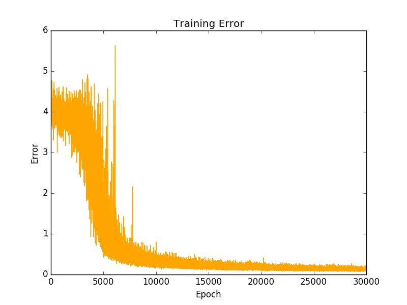

# RNN in Python

This is an example that I made to learn how to program a basic vanilla recursive neural network (RNN) trained with SGD. 

This is a toy example that learns how to add two 8-bit binary numbers. 

This program will print after each sample the training error, the result obtained, the expected output, and the interpretation of the sequence of bits. i.e.:

```
Error:   0.147690115696
Pred:    [1 1 0 0 1 1 1 0]
True:    [1 1 0 0 1 1 1 0]
119 + 87 = 206
```

By the end of the training, the program displays a plot that shows how the training error lowers through each epoch, as it can be seen in the next figure:



This example teached me the basics of an RNN such as the memory it requires to keep through the training from different time steps.

As well as why it is important to reset the update values between each trained sample. When people talk about this, it refers to the update in the sequence but not the overall training. 

